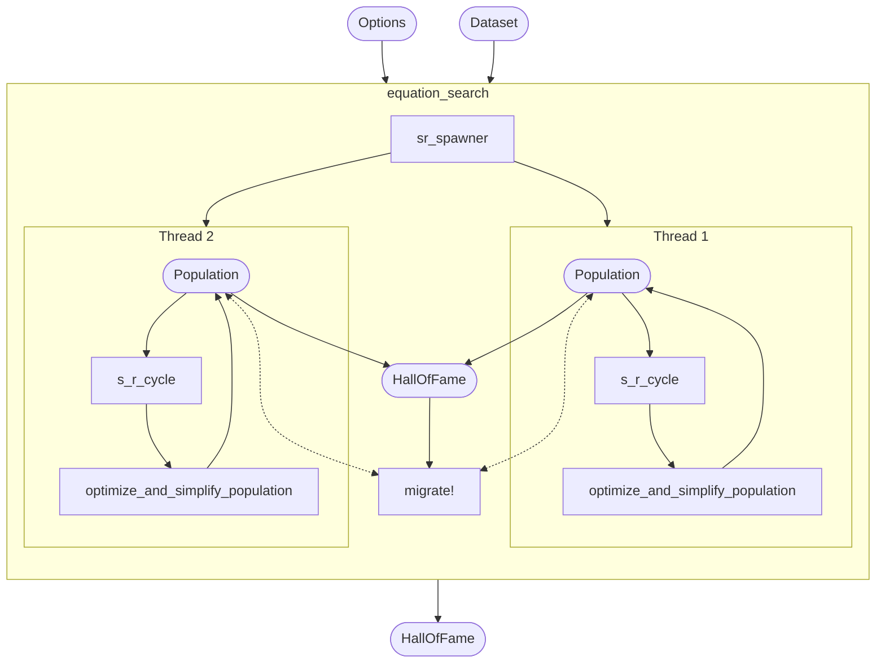

<!-- prettier-ignore-start -->
<div align="center">

SymbolicRegression.jl searches for symbolic expressions which optimize a particular objective.

https://github.com/MilesCranmer/SymbolicRegression.jl/assets/7593028/f5b68f1f-9830-497f-a197-6ae332c94ee0

| Latest release | Documentation | Forums | Paper |
| :---: | :---: | :---: | :---: |
| [](https://juliahub.com/ui/Packages/SymbolicRegression/X2eIS) | [](https://ai.damtp.cam.ac.uk/symbolicregression/dev/) | [](https://github.com/MilesCranmer/PySR/discussions) | [](https://arxiv.org/abs/2305.01582) |

| Build status | Coverage |
| :---: | :---: |
| [](.github/workflows/CI.yml) | [](https://coveralls.io/github/MilesCranmer/SymbolicRegression.jl?branch=master) |

Check out [PySR](https://github.com/MilesCranmer/PySR) for
a Python frontend.
[Cite this software](https://arxiv.org/abs/2305.01582)

</div>
<!-- prettier-ignore-end -->

**Contents**:

- [Quickstart](#quickstart)
  - [MLJ Interface](#mlj-interface)
  - [Low-Level Interface](#low-level-interface)
- [Constructing expressions](#constructing-expressions)
- [Exporting to SymbolicUtils.jl](#exporting-to-symbolicutilsjl)
- [Contributors ✨](#contributors-)
- [Code structure](#code-structure)
- [Search options](#search-options)

## Quickstart

Install in Julia with:

```julia
using Pkg
Pkg.add("SymbolicRegression")
```

### MLJ Interface

The easiest way to use SymbolicRegression.jl
is with [MLJ](https://github.com/alan-turing-institute/MLJ.jl).
Let's see an example:

```julia
import SymbolicRegression: SRRegressor
import MLJ: machine, fit!, predict, report

# Dataset with two named features:
X = (a = rand(500), b = rand(500))

# and one target:
y = @. 2 * cos(X.a * 23.5) - X.b ^ 2

# with some noise:
y = y .+ randn(500) .* 1e-3

model = SRRegressor(
    niterations=50,
    binary_operators=[+, -, *],
    unary_operators=[cos],
)
```

Now, let's create and train this model
on our data:

```julia
mach = machine(model, X, y)

fit!(mach)
```

You will notice that expressions are printed
using the column names of our table. If,
instead of a table-like object,
a simple array is passed
(e.g., `X=randn(100, 2)`),
`x1, ..., xn` will be used for variable names.

Let's look at the expressions discovered:

```julia
report(mach)
```

Finally, we can make predictions with the expressions
on new data:

```julia
predict(mach, X)
```

This will make predictions using the expression
selected by `model.selection_method`,
which by default is a mix of accuracy and complexity.

You can override this selection and select an equation from
the Pareto front manually with:

```julia
predict(mach, (data=X, idx=2))
```

where here we choose to evaluate the second equation.

For fitting multiple outputs, one can use `MultitargetSRRegressor`
(and pass an array of indices to `idx` in `predict` for selecting specific equations).
For a full list of options available to each regressor, see the [API page](https://ai.damtp.cam.ac.uk/symbolicregression/dev/api/).

### Low-Level Interface

The heart of SymbolicRegression.jl is the
`equation_search` function.
This takes a 2D array and attempts
to model a 1D array using analytic functional forms.
**Note:** unlike the MLJ interface,
this assumes column-major input of shape [features, rows].

```julia
import SymbolicRegression: Options, equation_search

X = randn(2, 100)
y = 2 * cos.(X[2, :]) + X[1, :] .^ 2 .- 2

options = Options(
    binary_operators=[+, *, /, -],
    unary_operators=[cos, exp],
    populations=20
)

hall_of_fame = equation_search(
    X, y, niterations=40, options=options,
    parallelism=:multithreading
)
```

You can view the resultant equations in the dominating Pareto front (best expression
seen at each complexity) with:

```julia
import SymbolicRegression: calculate_pareto_frontier

dominating = calculate_pareto_frontier(hall_of_fame)
```

This is a vector of `PopMember` type - which contains the expression along with the score.
We can get the expressions with:

```julia
trees = [member.tree for member in dominating]
```

Each of these equations is an `Expression{T}` type for some constant type `T` (like `Float32`).

These expression objects are callable – you can simply pass in data:

```julia
tree = trees[end]
output = tree(X)
```


## Constructing expressions

Expressions are represented under-the-hood as the `Node` type which is developed
in the [DynamicExpressions.jl](https://github.com/SymbolicML/DynamicExpressions.jl/) package.
The `Expression` type wraps this and includes metadata about operators and variable names.

You can manipulate and construct expressions directly. For example:

```julia
using SymbolicRegression: Options, Expression, Node

options = Options(;
    binary_operators=[+, -, *, /], unary_operators=[cos, exp, sin]
)
operators = options.operators
variable_names = ["x1", "x2", "x3"]
x1, x2, x3 = [Expression(Node(Float64; feature=i); operators, variable_names) for i=1:3]

tree = cos(x1 - 3.2 * x2) - x1 * x1
```

This tree has `Float64` constants, so the type of the entire tree
will be promoted to `Node{Float64}`.

We can convert all constants (recursively) to `Float32`:

```julia
float32_tree = convert(Expression{Float32}, tree)
```

We can then evaluate this tree on a dataset:

```julia
X = rand(Float32, 3, 100)

tree(X)
```

This callable format is the easy-to-use version which will
automatically set all values to NaN if there were any
Inf or NaN during evaluation. You can call the raw evaluation
method with `eval_tree_array`:

```julia
output, did_succeed = eval_tree_array(tree, X)
```

where `did_succeed` explicitly declares whether the evaluation was successful.

## Exporting to SymbolicUtils.jl

We can view the equations in the dominating
Pareto frontier with:

```julia
dominating = calculate_pareto_frontier(hall_of_fame)
```

We can convert the best equation
to [SymbolicUtils.jl](https://github.com/JuliaSymbolics/SymbolicUtils.jl)
with the following function:

```julia
import SymbolicRegression: node_to_symbolic

eqn = node_to_symbolic(dominating[end].tree)
println(simplify(eqn*5 + 3))
```

We can also print out the full pareto frontier like so:

```julia
import SymbolicRegression: compute_complexity, string_tree

println("Complexity\tMSE\tEquation")

for member in dominating
    complexity = compute_complexity(member, options)
    loss = member.loss
    string = string_tree(member.tree, options)

    println("$(complexity)\t$(loss)\t$(string)")
end
```

<!-- markdownlint-restore -->
<!-- prettier-ignore-end -->

<!-- ALL-CONTRIBUTORS-LIST:END -->

## Code structure

SymbolicRegression.jl is organized roughly as follows.
Rounded rectangles indicate objects, and rectangles indicate functions.

> (if you can't see this diagram being rendered, try pasting it into [mermaid-js.github.io/mermaid-live-editor](https://mermaid-js.github.io/mermaid-live-editor))



The `HallOfFame` objects store the expressions with the lowest loss seen at each complexity.

The dependency structure of the code itself is as follows:

```mermaid
stateDiagram-v2
    AdaptiveParsimony --> Mutate
    AdaptiveParsimony --> Population
    AdaptiveParsimony --> RegularizedEvolution
    AdaptiveParsimony --> SearchUtils
    AdaptiveParsimony --> SingleIteration
    AdaptiveParsimony --> SymbolicRegression
    CheckConstraints --> Mutate
    CheckConstraints --> SymbolicRegression
    Complexity --> CheckConstraints
    Complexity --> HallOfFame
    Complexity --> LossFunctions
    Complexity --> MLJInterface
    Complexity --> Mutate
    Complexity --> PopMember
    Complexity --> Population
    Complexity --> SearchUtils
    Complexity --> SingleIteration
    Complexity --> SymbolicRegression
    ConstantOptimization --> ExpressionBuilder
    ConstantOptimization --> Mutate
    ConstantOptimization --> SingleIteration
    Core --> AdaptiveParsimony
    Core --> CheckConstraints
    Core --> Complexity
    Core --> ConstantOptimization
    Core --> DimensionalAnalysis
    Core --> ExpressionBuilder
    Core --> ExpressionBuilder
    Core --> HallOfFame
    Core --> InterfaceDynamicExpressions
    Core --> LossFunctions
    Core --> MLJInterface
    Core --> Migration
    Core --> Mutate
    Core --> MutationFunctions
    Core --> PopMember
    Core --> Population
    Core --> Recorder
    Core --> RegularizedEvolution
    Core --> SearchUtils
    Core --> SingleIteration
    Core --> SymbolicRegression
    Dataset --> Core
    DimensionalAnalysis --> LossFunctions
    ExpressionBuilder --> SymbolicRegression
    HallOfFame --> ExpressionBuilder
    HallOfFame --> MLJInterface
    HallOfFame --> SearchUtils
    HallOfFame --> SingleIteration
    HallOfFame --> SymbolicRegression
    HallOfFame --> deprecates
    InterfaceDynamicExpressions --> ExpressionBuilder
    InterfaceDynamicExpressions --> HallOfFame
    InterfaceDynamicExpressions --> LossFunctions
    InterfaceDynamicExpressions --> SymbolicRegression
    InterfaceDynamicQuantities --> Dataset
    InterfaceDynamicQuantities --> MLJInterface
    LossFunctions --> ConstantOptimization
    LossFunctions --> ExpressionBuilder
    LossFunctions --> ExpressionBuilder
    LossFunctions --> Mutate
    LossFunctions --> PopMember
    LossFunctions --> Population
    LossFunctions --> SingleIteration
    LossFunctions --> SymbolicRegression
    MLJInterface --> SymbolicRegression
    Migration --> SymbolicRegression
    Mutate --> RegularizedEvolution
    MutationFunctions --> ExpressionBuilder
    MutationFunctions --> Mutate
    MutationFunctions --> Population
    MutationFunctions --> SymbolicRegression
    MutationFunctions --> deprecates
    MutationWeights --> Core
    MutationWeights --> Options
    MutationWeights --> OptionsStruct
    Operators --> Core
    Operators --> Options
    Options --> Core
    OptionsStruct --> Core
    OptionsStruct --> Options
    OptionsStruct --> Options
    PopMember --> ConstantOptimization
    PopMember --> ExpressionBuilder
    PopMember --> HallOfFame
    PopMember --> Migration
    PopMember --> Mutate
    PopMember --> Population
    PopMember --> SearchUtils
    PopMember --> SingleIteration
    PopMember --> SymbolicRegression
    Population --> ExpressionBuilder
    Population --> Migration
    Population --> RegularizedEvolution
    Population --> SearchUtils
    Population --> SingleIteration
    Population --> SymbolicRegression
    ProgramConstants --> Core
    ProgramConstants --> Dataset
    ProgramConstants --> Operators
    ProgressBars --> SearchUtils
    ProgressBars --> SymbolicRegression
    Recorder --> Mutate
    Recorder --> RegularizedEvolution
    Recorder --> SingleIteration
    Recorder --> SymbolicRegression
    RegularizedEvolution --> SingleIteration
    SearchUtils --> SymbolicRegression
    SingleIteration --> SymbolicRegression
    Utils --> ConstantOptimization
    Utils --> Dataset
    Utils --> DimensionalAnalysis
    Utils --> HallOfFame
    Utils --> InterfaceDynamicExpressions
    Utils --> MLJInterface
    Utils --> Migration
    Utils --> Operators
    Utils --> Options
    Utils --> PopMember
    Utils --> Population
    Utils --> RegularizedEvolution
    Utils --> SearchUtils
    Utils --> SingleIteration
    Utils --> SymbolicRegression
```



Bash command to generate dependency structure from `src` directory (requires `vim-stream`):

```bash
echo 'stateDiagram-v2'
IFS=$'\n'
for f in *.jl; do
    for line in $(cat $f | grep -e 'import \.\.' -e 'import \.' -e 'using \.' -e 'using \.\.'); do
        echo $(echo $line | vims -s 'dwf:d$' -t '%s/^\.*//g' '%s/Module//g') $(basename "$f" .jl);
    done;
done | vims -l 'f a--> ' | sort
```

## Search options

See https://ai.damtp.cam.ac.uk/symbolicregression/stable/api/#Options
